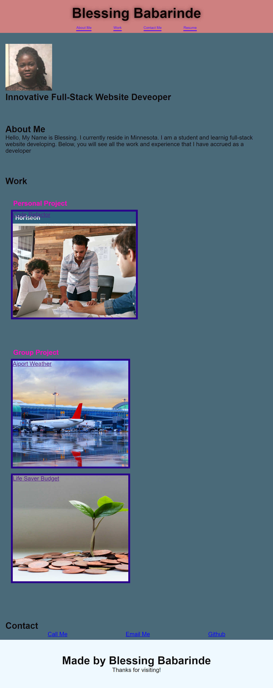

# Blessing's Portfolio

[](https://opensource.org/licenses/MIT)

## Description

As a future employer as a website developer, I have created an employee portfolio to my work samples. On this website my work samples can be review and assess by employers.

## Usage



## Installation

The project was uploaded to [GitHub](https://github.com/)

The repository creted for the project is : [ https://blessingbab.github.io/BlessingBabPortfolio/ ](https://blessingbab.github.io/BlessingBabPortfolio/)

## Process

```
Load developer's profolio
Developer's name, photo, and links.
Created and link navigation bars
Linked previous projects
Comment all changes in HTML and CSS
Created a README
```

## License

MIT

## Questions

For questions, please refer to the GitHub information listed below

## Contributors

Blessing Babarinde github.com/blessingBab
